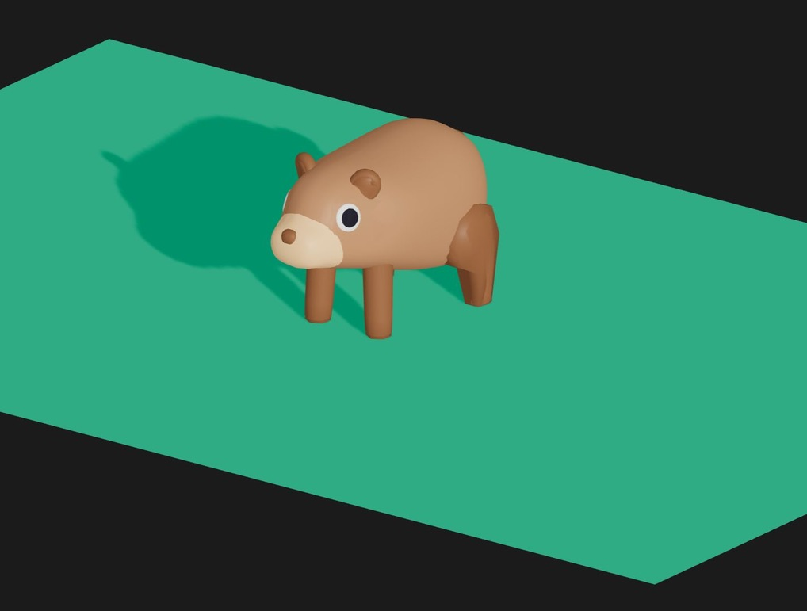

# CODER BEAR

## Explanation

This is an idea of a future project, this project has been crafted by LucasDDiazCuenca & Flors Rueda. Both of us have graduated from ISDI Coders, with proposals that have utilized the Three.js and React Three Fiber libraries. We have come together to embark on a secret project with the aim of having fun and further enhancing our skills as developers.

## Development Guidelines

Welcome to the Coder Bear development guidelines! These guidelines are designed to ensure consistency and clarity throughout the development process. Please review the following instructions carefully before contributing to the project.

### Issues

1. **Title**:
    - Descriptive title summarizing the main objective to implement.
2. **Body**:
   Use headings to organize:
    - **Use Case**:
        - Describe the specific use case or scenario prompting the need for this feature or fix.
    - **About** (if adding new features):
        - Provide additional context and details about the feature to be implemented.
    - **Benefits** (if enhancing or refactoring code, fixing bugs):
        - Explain how the proposed changes will improve the codebase.
    - **Proposed Implementation**:
        - Detail the proposed steps or approach to implementing the feature or fix as a check task list.
3. **Milestone**:
    - Link the issue to the corresponding milestone.
4. **Labels**:
    - Use some of the availables or create new ones.
        - Use lowercase labels (two words max) with a brief description.
5. **Branch**:
    - Link a new branch to the development section with the **develop branch as origin**.
    - Branch naming convention:
        - For adding new features: `feature/short-naming-of-new-feature`
        - For adding or modifying tests: `test/name-features-to-test`
        - For bug fixes: `bugfix/short-description-of-bug`
        - For refactoring without adding new features or fixing bugs: `refactor/short-description`
        - To quickly fix a critical issue in production: `hotfix/short-description`

### Pull Requests

1. **Title**:
    - Use the name of the branch.
2. **Description**:
    - Detail the changes made and their purpose.
    - Reference the linked issue.
3. **Reviewers**:
    - Assign reviewers for the pull request.
4. **Labels**:
    - Use relevant labels to categorize the pull request.
5. **Linked Issues**:
    - Reference the linked issue(s).
6. **Milestone**:
    - Link to the corresponding milestone.

### Commits

1. **Branch**:
    - Commit to the branch linked to the issue or create a new one and then link it if it doesn't exist, **should have the develop branch as origin**.
    - Branch naming convention:
        - See _Issues / 7. Branch_ section.
2. **Commit Message**:
    - Start with the number of the issue (e.g., #001).
    - Describe the committed changes using verb+complements format (e.g., "Add new home button").
3. **Commit Size**:
    - Make small, focused commits corresponding to individual tasks or smaller changes.

## Test Suite and Continuous Integration Pipeline

This repository includes a pipeline designed to automate the testing and building process whenever changes are pushed to the repository. Read more about it [here](./docs/test-and-ci-pipeline.md).

## Credits & personal portfolios

Big thanks to all contributors ❤️❤️

**Lucas Diaz** ✨:

https://www.lucasdiaz.xyz/

**Flors Rueda** ✨:

https://flors.rucev.com/
